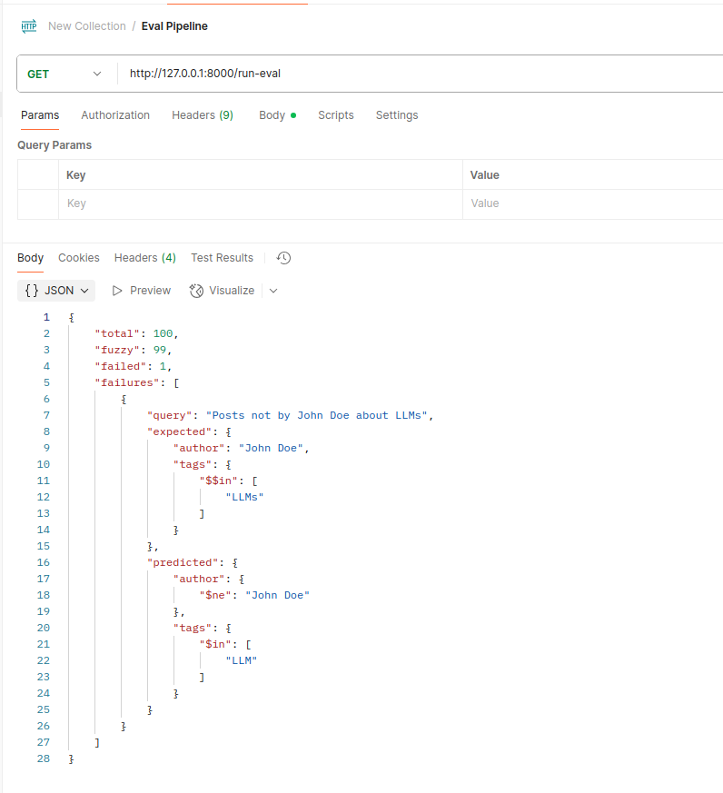

# Natural Language to Pinecone Query Agent

## Overview

This project demonstrates a Natural Language to Pinecone Query Agent. The system:
- Accepts user input in natural language
- Converts it into structured metadata filters
- Returns a Pinecone-compatible JSON query using supported metadata fields and operators

## Architecture Overview

| File           | Purpose                                         |
|----------------|-------------------------------------------------|
| `agent.py`     | Core logic to call the LLM and parse results    |
| `prompt.py`    | Few-shot prompt template                        |
| `main.py`      | FastAPI server exposing the endpoints   |
| `eval_pipeline.py` | Evaluation pipeline for the agent           |
| `data/`        | Contains `synthetic_eval_data.json`             |
| `Dockerfile`   | Dockerizes the FastAPI app                      |

## Model Used

- **Provider:** [OpenRouter](https://openrouter.ai)
- **Model:** `google/gemma-7b-it:free`
- **Feature:** Structured Output

**Why this model?**
- Free-tier access for developers
- Easy integration without an OpenAI key

## Setup Instructions

1. **Clone the Repository**
   ```bash
   git clone <repo-url>
   cd bridged-demo
   ```

2. **Install Dependencies**
   ```bash
   uv venv
   uv pip install -r requirements.txt
   ```

3. **Create a .env File**
   ```bash
   OPENROUTER_API_KEY=your_openrouter_api_key
   OPENROUTER_MODEL=google/gemma-7b-it:free
   OPENROUTER_BASE_URL=openrouter-api-url
   ```

4. **Run the FastAPI Application**
   ```bash
   uvicorn app.main:app --reload
   ```
   Then open your browser at [http://localhost:8000/docs](http://localhost:8000/docs) to access the Swagger UI for API documentation and testing.

## Evaluation Pipeline

- **Dataset:**
  - File: `app/data/synthetic_eval_data.json`
  - 100 natural language queries with expected structured outputs
  - Covers a variety of combinations (author, year, tags, operators)

- **API:**
  - Endpoint (GET): `/run-eval`
  - Alternatively, run the evaluation directly with:
    ```bash
    python app/eval_pipeline.py
    ```

- **Accuracy:**
  - The current implementation achieves **99% accuracy** (tested over 100 diverse samples).

  

## Docker Setup

1. **Build the Docker Image**
   ```bash
   docker build -t bridged-demo .
   ```

2. **Run the Docker Container**
   ```bash
   docker run -p 8000:8000 bridged-demo
   ```
   The API will be available at [http://localhost:8000/docs](http://localhost:8000/docs).